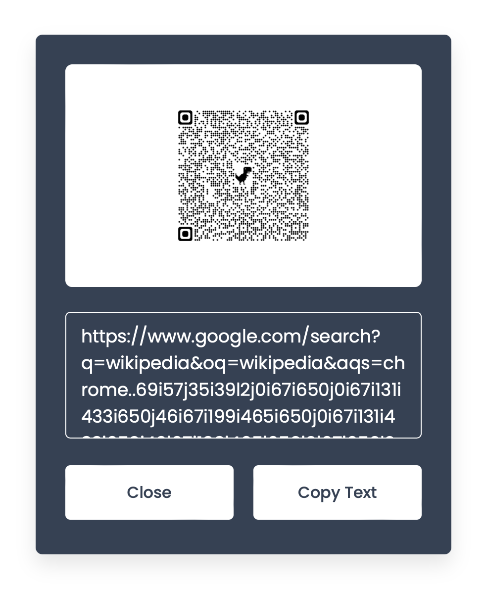

# QR Code Scanner

A web-based QR code scanner with a user-friendly interface.



## Table of Contents

- [Features](#features)
- [Technologies Used](#technologies-used)
- [Getting Started](#getting-started)
- [Installation](#installation)
- [Usage](#usage)
- [API Usage](#api-usage)
- [How to Contribute](#how-to-contribute)
- [License](#license)
- [Author](#author)
- [Acknowledgments](#acknowledgments)
- [Contact Information](#contact-information)

## Features

- Upload and scan QR codes from images.
- Copy scanned text to the clipboard.
- User-friendly interface.

## Technologies Used

- HTML
- JavaScript
- CSS
- [FontAwesome](https://fontawesome.com/)

## Getting Started

To get started with the QR code scanner, follow these steps:

## Installation

1. Clone this repository.
2. Open `index.html` in your browser.

## Usage

- Click on the "Upload QR Code To Read" button to scan a QR code.

```javascript
// Example code snippet
// Add relevant code snippets here
```

## License
This project is licensed under the MIT License.

## Author
Your Name
- GitHub: [KSCHarika](https://github.com/kscharika)

## Acknowledgments
Mention any third-party libraries, resources, or individuals who contributed to the project.

## Contact Information
For inquiries or collaboration, please contact [here](mailto:kscharika.kalepu@gmail.com).
